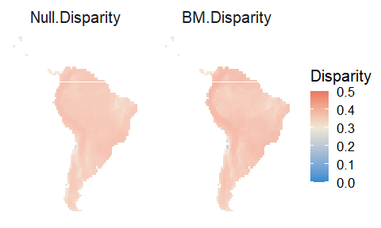

Supplementary material, Bridging macroecology and macroevolution in the
radiation of sigmodontine rodents
================
Maestri, R., Luza, A.L., Hartz, S.M., Freitas, T.R.O., Patterson, B.D.
April 2022

<!-- README.md is generated from README.Rmd. Please edit that file -->
<!-- badges: start -->
<!-- badges: end -->

### Appendix S2

This document presents the supplementary material of our article. The
supplementary information embraces analyzes for species with skull and
phylogenetic data (216 species), and also Oryzomyalia species. The
figures and tables presented here follow the same order and settings as
the ones shown in the main text:

1 - A table with the GLM coefficients, showing the differences in slope
of SES disparity \~ SES MPD relationship between empirical and simulated
datasets.(This table is similar to the Table 1 presented in the main
text).

2 - A plot depicting the relationship between SES-MPD (Mean Pairwise
(Phylogenetic) Distance between species) and the SES-disparity produced
by empirical (skull size and shape) and three simulated data sets
generated (Brownian motion\[BM\], Early-Burst\[EB\], and
Ornstein-Uhlenbeck \[OU\]). (This panel is similar to the Fig. 2
presented in the main text).

3 - A panel of five maps comprising the A) empirical morphological
disparity (as measured by Rao’s Entropy), B) disparity compared to a
randomization-based null model, C) disparity compared to an
evolutionarily oriented null model (OU for disparity in skull size, BM
for disparity in skull shape), D) cells presenting significant
deviations of disparity compared to a randomization-based null model
(all values presented in B), E) cells presenting significant deviations
of disparity compared to a evolutionarily oriented null model (all
values presented in C). This figure is similar to the Fig. 3 presented
in the main text.

4 - A panel comprising four maps, showing the disparity expected by i) a
randomization-based null model, ii) BM model, iii) EB model, iv) OU
model. The correlation between these values is presented in a separate
table after the map. (This panel is similar to the Fig. 4 presented in
the main text).

The values of parameters, estimated through macroevolutionary models
(using ‘fitContinuous’ in univariate datasets (skull size), and ‘mvgls’
in multivariate datasets (skull shape)), are only presented here in the
supplementary material.

#### The relationship between species richness and skull disparity (before and after a randomization-based null model)

Fig. S2.1. The relationship between assemblage-level species richness
(SR) and observed/empirical values of the empirical phenotypic disparity
of skull size (Rao’s entropy index) (left), the disparity compared to a
randomization-based null model (middle), and the disparity compared to
an evolution-oriented model (Ornstein-Uhlenbeck) (right).

Fig. S2.2. The relationship between assemblage-level species richness
(SR) and observed/empirical values of the empirical phenotypic disparity
of skull shape (Rao’s entropy index) (left), the disparity compared to a
randomization-based null model (middle), and the disparity compared to
an evolution-oriented model (Brownian motion) (right).

#### Results considering the complete set of species (413 species), and using the complete sample of 100 fully resolved phylogenies from Upham et al. (2019) to consider phylogenetic uncertainty on parameter estimates.

Fig. S2.3. Density plot showing the estimates of each model parameter
for univariate and multivariate macroevolutionary models. In the top we
show the estimates of the parameter ‘sigma’ for the BM, EB, and OU
models of evolution (estimated by evolutionary models (fitContinuous)
applied to univariate trait data (skull size)). In the middle we show
the estimates of the parameters ‘beta’ and ‘alpha’, which are specific
from EB and OU, respectively. In the bottom, we show the estimates of
the parameter ‘sigma’ for the BM model (evolutionary models (mvGLS)
applied to multivariate trait data (skull shape)). In univariate models,
the density represents variation in estimates across the 100 fully
resolved phylogenies. In the multivariate model, the density represents
variation of sigma across traits and phylogenies (112 simulated
‘landmarks’ and 100 fully resolved phylogenies). Results for the dataset
of 413 species.

<!-- badges: start -->
<!-- badges: end -->

Below we present a table of GLM coefficients that considers phylogenetic
uncertainty while testing which model produced a simulated disparity
closer to the empirical disparity (results alternative to Table 1 in the
main text). It shows show that the disparity simulated by the OU model
gets closer to the empirical disparity than the disparity estimated by
other models (Table S2.1). The GLM estimates were averaged (and its
standard deviation calculated) across 100 runs per phylogeny (for 100
fully resolved phylogenies).

Table S2.1: Averaged GLM estimates, obtained by averaging the estimates
across the 100 fully resolved phylogenies. Results for the dataset of
413 species.

    ##                  Estimate Std. Error   t value     Pr(>|t|)
    ## (Intercept)    0.41951107 0.04291587  9.836620 1.611533e-13
    ## MPD           -0.08265248 0.01773169 -4.692754 7.277070e-03
    ## datasetBM     -0.36583792 0.06069220 -6.111344 4.037407e-02
    ## datasetEB     -0.39576278 0.06069220 -6.644241 5.016113e-02
    ## datasetOU     -0.42095639 0.06069220 -6.991466 3.445204e-02
    ## MPD:datasetBM  0.27680513 0.02507639 11.154513 2.145854e-02
    ## MPD:datasetEB  0.25900668 0.02507639 10.463898 2.773115e-02
    ## MPD:datasetOU  0.14709810 0.02507639  5.935941 7.554150e-02

Table S2.2: Standard deviation of GLM estimates across the 100 fully
resolved phylogenies. Results for the dataset of 413 species.

    ##                 Estimate  Std. Error   t value     Pr(>|t|)
    ## (Intercept)   0.04221835 0.003809334  1.171888 1.564391e-12
    ## MPD           0.02360367 0.002000536  1.341819 3.814276e-02
    ## datasetBM     0.41024451 0.005387211  6.821072 1.301869e-01
    ## datasetEB     0.41023149 0.005387211  6.931416 1.699229e-01
    ## datasetOU     0.42716073 0.005387211  6.978750 1.092794e-01
    ## MPD:datasetBM 0.24336830 0.002829185  9.656811 1.057659e-01
    ## MPD:datasetEB 0.26186764 0.002829185 10.450733 1.104965e-01
    ## MPD:datasetOU 0.21457778 0.002829185  8.717895 1.948662e-01

### Analysis for 216 species, and considering phylogenetic uncertainty

Using this data subset, the estimated parameters of macroevolutionary
models were very similar to those estimated for the complete set of
species (compare Figs. S2.1 and S2.2). We then produced a bivariate plot
describing the relationship between SES-disparity and SES-MPD for
empirical and simulated data sets. We found that this relationship (Fig.
S2.3) was similar to the one reported in the main results (Fig. 2).
Overall, the disparity produced by the OU model had a closer
relationship with the empirical disparity than had the other models of
evolution (BM and EB) (Fig. S2.5).

Fig. S2.4.Density plot showing the estimates of each model parameter for
univariate and multivariate macroevolutionary models. In the top we show
the estimates of the parameter ‘sigma’ for the BM, EB, and OU models of
evolution (estimated by evolutionary models (fitContinuous) applied to
univariate trait data (skull size)). In the middle we show the estimates
of the parameters ‘beta’ and ‘alpha’, which are specific from EB and OU,
respectively. In the bottom, we show the estimates of the parameter
‘sigma’ for the BM model (evolutionary models (mvGLS) applied to
multivariate trait data (skull shape)). In univariate models, the
density represents variation in estimates across the 100 fully resolved
phylogenies. In the multivariate model, the density represents variation
of sigma across traits and phylogenies (112 simulated ‘landmarks’ and
100 fully resolved phylogenies). Results for the dataset of 216 species.

<!-- badges: start -->
<!-- badges: end -->

Fig. S2.5. Bivariate plot showing the relationship between SES-MPD and
SES-disparity for empirical and simulated datasets. Results produced for
the dataset of 216 species.

<!-- badges: start -->
<!-- badges: end -->

As presented in the results (mapping section), we counted the number of
cells with values of disparity higher, equal, or lower than the null
model (randomization-based null model, NULL) and the evolutionary
models. We found that 10, 11 and 11 assemblages had a disparity lower
than expected by the OU, EB and BM models, respectively; three
assemblages had a disparity lower than expected by the null model. None
assemblage had a disparity higher than predicted by BM, OU and EB
models, and 90 assemblages had a disparity lower than the null model.

    ## $lower
    ##      lowerNULL lowerOU lowerBM lowerEB
    ## TRUE         3      10      11      11
    ## 
    ## $higher
    ##      highNULL highOU highBM highEB
    ## TRUE       90     NA     NA     NA

<!-- badges: start -->
<!-- badges: end -->

When mapping the values of empirical and simulated trait values, we
found a high agreement between the datasets of 413 and 216 species (Fig.
S2.6).

Fig. S2.6. Map of empirical (A), null (random shuffling of species in
trait matrix) (B) and simulated disparity (using the OU model) (C). In D
we show the significance of SES values presented in B, and in E we show
the significance of SES values presented in C. Results produced by using
the dataset of 216 species.

<!-- badges: start -->
<!-- badges: end -->

Finally, we show the maps of null and simulated disparity (Fig. S2.7).
We found that using a randomization-based null model is similar to
simulating a trait using the OU model. This can be seen in the following
map (and the correlations presented after the Fig. S2.7), where the null
disparity and the disparity produced by the OU model produced highly
correlated maps (rho=0.96, Table below the map). The correlation was
also high between the null and BM disparity.

Fig. S2.7. Map of null (random shuffling of species in trait matrix) and
simulated disparity values (using the BM, OU and EB models of
evolution). The legend is common to all maps. Results produced by using
the dataset of 216 species.

Correlation between values of disparity

    ##                  RAO_OBS.med_nulo     obsBM     obsEB     obsOU
    ## RAO_OBS.med_nulo        1.0000000 0.8890401 0.8475222 0.9625762
    ## obsBM                   0.8890401 1.0000000 0.9534437 0.9385652
    ## obsEB                   0.8475222 0.9534437 1.0000000 0.9268018
    ## obsOU                   0.9625762 0.9385652 0.9268018 1.0000000

### Results for subclade Oryzomyalia, considering phylogenetic uncertainty

The relationship was similar to the plots for the datasets of 413 and
216 species. However, the main difference is that we miss values of SES
MPD higher than zero as we are focusing on phylogenetic distances within
the subclade Oryzomyalia.

Fig. S2.8. Density plot showing the estimates of each model parameter
for univariate and multivariate macroevolutionary models. In the top we
show the estimates of the parameter ‘sigma’ for the BM, EB, and OU
models of evolution (estimated by evolutionary models (fitContinuous)
applied to univariate trait data (skull size)). In the middle we show
the estimates of the parameters ‘beta’ and ‘alpha’, which are specific
from EB and OU, respectively. In the bottom, we show the estimates of
the parameter ‘sigma’ for the BM model (evolutionary models (mvGLS)
applied to multivariate trait data (skull shape)). In univariate models,
the density represents variation in estimates across the 100 fully
resolved phylogenies. In the multivariate model, the density represents
variation of sigma across traits and phylogenies (112 simulated
‘landmarks’ and 100 fully resolved phylogenies).Results for the dataset
of Oryzomyalia species.

<!-- badges: start -->
<!-- badges: end -->

Fig. S2.9. Bivariate plot showing the relationship between SES MPD and
SES disparity, for empirical and simulated disparity. Results produced
by using the dataset of Oryzomyalia species.

<!-- badges: start -->
<!-- badges: end -->

The number of cells (assemblages) with disparity deviating from
randomization-based and evolutionarily oriented null models was similar
to the number found for the dataset of 216 species.

    ## $lower
    ##      lowerNULL lowerOU lowerBM lowerEB
    ## TRUE         2      11      12      18
    ## 
    ## $higher
    ##      highNULL highOU highBM highEB
    ## TRUE       89     NA     NA     NA

<!-- badges: start -->
<!-- badges: end -->

The maps of observed and simulated disparity still resemble the ones
shown in Fig. 3 (main text), and the ones just reported considering 216
species (Fig. S2.6). However, less assemblages had significantly lower
and higher disparity than the disparity expected by the OU model (Fig.
S2.10).

Fig. S2.10. Map of empirical (A), null (random shuffling of species in
trait matrix) (B) and simulated disparity (using the OU model) (C). In D
we show the significance of SES values presented in B, and in E we show
the significance of SES values presented in C. Results produced by using
the dataset of Oryzomyalia species.

<!-- badges: start -->
<!-- badges: end -->

Finally, there was a high correlation between null and simulated
disparity, especially for the OU model.

Fig. S2.11. Map of null (random shuffling of species in trait matrix)
and simulated disparity values (using the BM, OU and EB models of
evolution). The legend is common to all maps. Results for the dataset of
Oryzomyalia species.

The correlation between the null and simulated disparity was similar to
the correlation found for other datasets (the highest correlation was
found between NULL and OU-simulated disparity, with a rho=0.98).

    ##                  RAO_OBS.med_nulo     obsBM     obsEB     obsOU
    ## RAO_OBS.med_nulo        1.0000000 0.9494270 0.9593531 0.9822153
    ## obsBM                   0.9494270 1.0000000 0.9778866 0.9691552
    ## obsEB                   0.9593531 0.9778866 1.0000000 0.9723185
    ## obsOU                   0.9822153 0.9691552 0.9723185 1.0000000

### Appendix S3

#### Results considering the consensus phylogeny. As it has 285 tips, the number of species used in trait simulations was 285 (for traits simulated with all tips), being 169 with occurrence, trait and phylogenetic data.

The figures we will present now have the same settings and order as the
ones we presented above.

Parameter estimates for the univariate model fitted to skull size (table
below), and for the multivariate model fitted to skull shape (Fig.
S3.1).

    ##   Estimates Parameter model
    ## 1     0.124     sigma    BM
    ## 2     0.142     sigma    EB
    ## 3    -0.012      beta    EB
    ## 4     0.124     sigma    OU
    ## 5     0.000     alpha    OU

Fig. S3.1: Density plot of the sigma parameter, as estimated by the BM
macroevolutionary model fitted to skull shape data. Results produced by
using the data set of 285 species in the consensus tree.

<!-- badges: start -->
<!-- badges: end -->

Bivariate plot similar to Fig. 2. The OU-resulting disparity is still
closer to the empirical disparity than other models (see the table of
coefficients and the difference in slope (i.e., the effect of the
interaction between SR and the classes of null models)).

Fig. S3.2. Bivariate plot showing the relationship between SES MPD and
SES disparity, for empirical and simulated disparity. Results for the
data set of 285 species present in the consensus tree.

<!-- badges: start -->
<!-- badges: end -->

    ## 
    ## Call:
    ## lm(formula = value ~ MPD * Data, data = av_disp)
    ## 
    ## Residuals:
    ##     Min      1Q  Median      3Q     Max 
    ## -3.2975 -0.1929 -0.0287  0.1157  2.8196 
    ## 
    ## Coefficients:
    ##             Estimate Std. Error t value Pr(>|t|)    
    ## (Intercept)  0.14841    0.02583   5.745 9.60e-09 ***
    ## MPD          0.04471    0.01258   3.553 0.000384 ***
    ## DataBM      -0.12768    0.03653  -3.495 0.000477 ***
    ## DataEB      -0.10271    0.03653  -2.812 0.004945 ** 
    ## DataOU      -0.23521    0.03653  -6.439 1.29e-10 ***
    ## MPD:DataBM   0.19405    0.01780  10.903  < 2e-16 ***
    ## MPD:DataEB   0.17331    0.01780   9.738  < 2e-16 ***
    ## MPD:DataOU   0.09605    0.01780   5.397 7.04e-08 ***
    ## ---
    ## Signif. codes:  0 '***' 0.001 '**' 0.01 '*' 0.05 '.' 0.1 ' ' 1
    ## 
    ## Residual standard error: 0.5911 on 6280 degrees of freedom
    ## Multiple R-squared:  0.1809, Adjusted R-squared:  0.1799 
    ## F-statistic: 198.1 on 7 and 6280 DF,  p-value: < 2.2e-16

We found that 28 assemblages had a disparity lower than the null model,
whereas 7, 28 and 24 assemblages had disparity lower than the OU, BM and
EB models, respectively. We found that 467 assemblages had a disparity
higher than expected by the OU model, and 53 assemblages had a disparity
higher than the null model. None assemblage had disparity higher than
expected by the BM and EB models.

    ## $lower
    ##      lowerNULL lowerOU lowerBM lowerEB
    ## TRUE        38       7      28      24
    ## 
    ## $higher
    ##      highNULL highOU highBM highEB
    ## TRUE       53    467     NA     NA

<!-- badges: start -->
<!-- badges: end -->

Maps similar to Fig. 3, and to maps just reported considering other
datasets (Fig. S2.6 and S2.10). The maps still resemble the ones found
in the main text, but now we did not find cells (assemblages) with a
disparity higher or lower than expected by an OU model of evolution.

Fig. S3.3. Map of empirical (A), null (random shuffling of species in
trait matrix) (B) and simulated disparity (using the BM model) (C). In D
we show the significance of SES values presented in B, and in E we show
the significance of SES values presented in C. Results for the dataset
of 285 species present in the consensus tree.

Using the consensus phylogeny, we found variation relative to results
presented above and in the main text. The maps of BM- and OU-simulated
disparity showed higher spatial variation than reported previously.

Fig. S3.4. Map of null (random shuffling of species in trait matrix) and
simulated disparity values (using the BM, OU and EB models of
evolution). The legend is common to all maps. Results for the dataset of
285 species present in the consensus tree.

<!-- badges: start -->
<!-- badges: end -->

The correlation between the null disparity and the simulated disparity
was moderate to high. The highest correlation we found was between BM-
and EB-simulated disparity (rho = 0.95). The correlation between the
null disparity and the OU-simulated disparity was rho = 0.37.

    ##                  RAO_OBS.med_nulo     obsBM     obsEB     obsOU
    ## RAO_OBS.med_nulo        1.0000000 0.8019505 0.7970357 0.3668096
    ## obsBM                   0.8019505 1.0000000 0.9557484 0.4459697
    ## obsEB                   0.7970357 0.9557484 1.0000000 0.4662957
    ## obsOU                   0.3668096 0.4459697 0.4662957 1.0000000

## Appendix S4

#### Results considering skull shape, and the application of macroevolutionary models for multivariate trait simulation fitted to skull shape (using a BM model of evolution). The estimates of model parameters for datasets of 216 species and Oryzomyalia species were presented in Figs. S2.3 and S2.8.

None assemblage had disparity higher than the null model, whereas only
four assemblages had a disparity higher than the BM model. Nonetheless,
480 assemblages had a disparity lower than the null model, and 860
assemblages had a disparity lower than the BM model.

    ## $lower
    ##      lowerNULL lowerBM
    ## TRUE       480     806
    ## 
    ## $higher
    ##      highNULL highBM
    ## <NA>       NA      4

<!-- badges: start -->
<!-- badges: end -->

The BM model had a good fit to skull shape (Fig. S4.1, Table S4.1).

Fig. S4.1. Bivariate plot showing the relationship between SES MPD and
SES disparity, for empirical and simulated disparity (multivariate trait
simulations using the Brownian-motion model of evolution). Results for
the dataset of 216 species.

<!-- badges: start -->
<!-- badges: end -->

Table S4.1: Averaged GLM estimates, obtained by averaging estimates
produced by each one of the 100 different phylogenies used to simulate
traits and calculate disparity. Results for the dataset of 216 species.

    ##                  Estimate Std. Error   t value      Pr(>|t|)
    ## (Intercept)   -0.11989648 0.03947344 -3.079593  7.904859e-02
    ## MPD            0.54050076 0.01631589 33.482403 1.903306e-108
    ## datasetBM      0.16171537 0.05582387  2.935900  9.517206e-02
    ## MPD:datasetBM -0.09359235 0.02307415 -3.950603  3.464664e-02

Table S4.2: Standard deviation of GLM estimates, obtained by calculating
the standard deviation of estimates produced by each one of the 100
different phylogenies used to simulate traits and calculate disparity.
Results for the dataset of 216 species.

    ##                 Estimate  Std. Error  t value      Pr(>|t|)
    ## (Intercept)   0.08220315 0.003829300 2.186437  1.458757e-01
    ## MPD           0.03881256 0.002010355 3.550319 1.893766e-107
    ## datasetBM     0.41893270 0.005415448 7.607369  2.250030e-01
    ## MPD:datasetBM 0.22694128 0.002843071 9.681416  1.192826e-01

<!-- badges: start -->
<!-- badges: end -->

Assemblages presenting lower disparity than predicted by a BM model of
evolution were located throughout South America except the eastern and
southern region (Fig. S4.2).

Fig. S4.2. Map of empirical (A), null (random shuffling of species in
trait matrix) (B) and simulated disparity (using the BM model) (C). In D
we show the significance of SES values presented in B, and in E we show
the significance of SES values presented in C. Results for the dataset
of 216 species.

<!-- badges: start -->
<!-- badges: end -->

Fig. S4.3. Map of null (random shuffling of species in trait matrix) and
simulated disparity values (using the BM model of evolution to simulate
multivariate trait datasets). The legend is common to all maps. Results
for the dataset of 216 species.

    ##                  RAO_OBS.med_nulo     obsBM
    ## RAO_OBS.med_nulo        1.0000000 0.9293195
    ## obsBM                   0.9293195 1.0000000

### Results for subclade Oryzomyalia, considering phylogenetic uncertainty

    ## $lower
    ##      lowerNULL lowerBM
    ## TRUE       458    1008
    ## 
    ## $higher
    ##      highNULL highBM
    ## TRUE        1      3

Fig. S4.4. Bivariate plot showing the relationship between SES MPD and
SES disparity, for empirical and simulated disparity (multivariate trait
simulations using Brownian motion model evolution). Results for the
dataset of Oryzomyalia species.

<!-- badges: start -->
<!-- badges: end -->

Table S4.3: Averaged GLM estimates, obtained by averaging estimates
produced by each one of the 100 different phylogenies used to simulate
traits and calculate disparity. Results for the dataset of Oryzomyalia
species.

    ##                 Estimate Std. Error   t value      Pr(>|t|)
    ## (Intercept)   -0.1494278 0.03592063 -4.361487  5.493398e-02
    ## MPD            0.4177589 0.01146675 36.668705 4.549490e-164
    ## datasetBM      0.1755463 0.05079944  3.554921  1.002113e-01
    ## MPD:datasetBM -0.1572541 0.01621643 -9.384956  3.508392e-02

Table S4.4: Standard deviation of GLM estimates, obtained by calculating
the standard deviation of estimates produced by each one of the 100
different phylogenies used to simulate traits and calculate disparity.
Results for the dataset of Oryzomyalia species.

    ##                 Estimate  Std. Error   t value  Pr(>|t|)
    ## (Intercept)   0.09947100 0.003517084  3.258340 0.1681786
    ## MPD           0.04021881 0.001439523  2.968131 0.0000000
    ## datasetBM     0.41706099 0.004973908  8.257509 0.2235813
    ## MPD:datasetBM 0.19903811 0.002035793 11.852784 0.1393277

Fig. S4.5. Map of empirical (A), null (random shuffling of species in
trait matrix) (B) and simulated disparity (using the BM model) (C). In D
we show the significance of SES values presented in B, and in E we show
the significance of SES values presented in C. Results for the dataset
of Oryzomyalia species.

Fig. S4.6. Map of null (random shuffling of species in trait matrix) and
simulated disparity values (using the BM model of evolution to simulate
multivariate trait datasets). The legend is common to all maps. Results
for the dataset of Oryzomyalia species.

<!-- badges: start -->
<!-- badges: end -->

    ##                  RAO_OBS.med_nulo     obsBM
    ## RAO_OBS.med_nulo        1.0000000 0.9634121
    ## obsBM                   0.9634121 1.0000000

## Results for the dataset of 285 species present in the consensus tree.

    ## $lower
    ##      lowerNULL lowerBM
    ## TRUE       473     957
    ## 
    ## $higher
    ##      highNULL highBM
    ## <NA>       NA     41

<!-- badges: start -->
<!-- badges: end -->

Fig. S4.7. Bivariate plot showing the relationship between SES MPD and
SES disparity, for empirical and simulated disparity (multivariate trait
simulations using Brownian motion model evolution). Results for the
dataset of 285 species present in the consensus tree.

<!-- badges: start -->
<!-- badges: end -->

Table S4.5: Averaged GLM estimates, obtained by averaging estimates
produced by each one of the 100 different phylogenies used to simulate
traits and calculate disparity. Results for the dataset of 285 species
present in the consensus tree.

    ## 
    ## Call:
    ## lm(formula = value ~ MPD * Data, data = av_disp)
    ## 
    ## Residuals:
    ##      Min       1Q   Median       3Q      Max 
    ## -2.46518 -0.19241  0.01479  0.18853  2.62946 
    ## 
    ## Coefficients:
    ##             Estimate Std. Error t value Pr(>|t|)    
    ## (Intercept) -0.41323    0.02814 -14.687  < 2e-16 ***
    ## MPD          0.49420    0.01371  36.052  < 2e-16 ***
    ## DataBM       0.47329    0.03979  11.895  < 2e-16 ***
    ## MPD:DataBM   0.10713    0.01939   5.526 3.54e-08 ***
    ## ---
    ## Signif. codes:  0 '***' 0.001 '**' 0.01 '*' 0.05 '.' 0.1 ' ' 1
    ## 
    ## Residual standard error: 0.6438 on 3140 degrees of freedom
    ## Multiple R-squared:  0.519,  Adjusted R-squared:  0.5185 
    ## F-statistic:  1129 on 3 and 3140 DF,  p-value: < 2.2e-16

Fig. S4.8. Map of empirical (A), null (random shuffling of species in
trait matrix) (B) and simulated disparity (using the BM model) (C). In D
we show the significance of SES values presented in B, and in E we show
the significance of SES values presented in C. Results for the dataset
of 285 species present in the consensus tree.

<!-- badges: start -->
<!-- badges: end -->

Fig. S4.9. Map of null (random shuffling of species in trait matrix) and
simulated disparity values (using the BM model of evolution to simulate
multivariate trait datasets). The legend is common to all maps. Results
for the 285 species present in the consensus tree.

    ##                  RAO_OBS.med_nulo     obsBM
    ## RAO_OBS.med_nulo        1.0000000 0.8845862
    ## obsBM                   0.8845862 1.0000000

Fig. S4.10. Map of null (random shuffling of species in trait matrix)
and simulated disparity values (using the BM model of evolution to
simulate multivariate trait datasets). The legend is common to all maps.
Results for the dataset of 413 species and 100 fully resolved
phylogenies.

    ##                  RAO_OBS.med_nulo     obsBM
    ## RAO_OBS.med_nulo        1.0000000 0.9351824
    ## obsBM                   0.9351824 1.0000000
