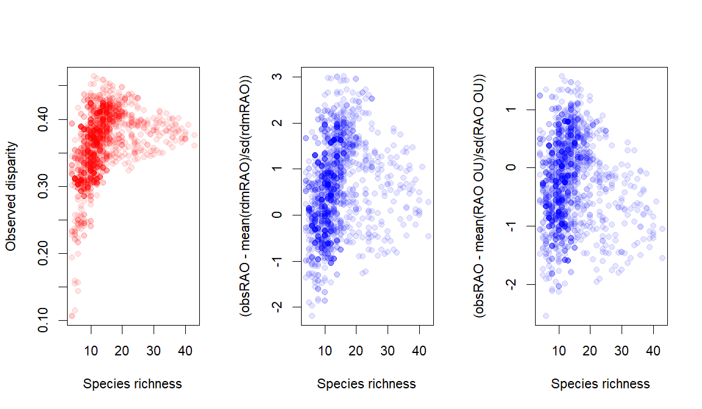
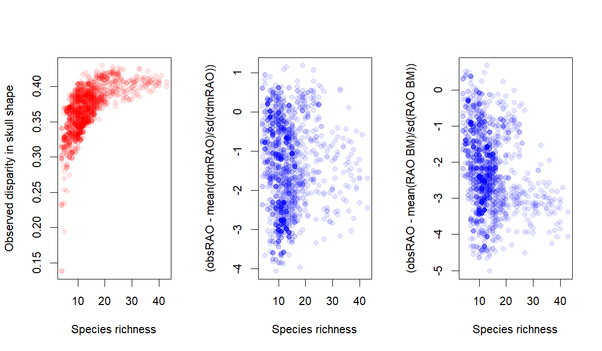
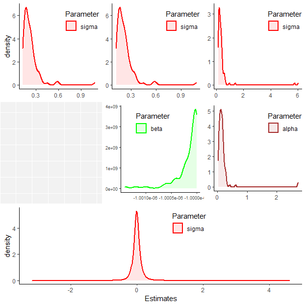
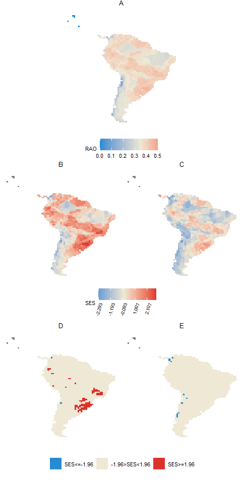

Supplementary material, Bridging macroecology and macroevolution in the
radiation of sigmodontine rodents
================
-
March 2022

<!-- README.md is generated from README.Rmd. Please edit that file -->
<!-- badges: start -->
<!-- badges: end -->

### Appendix S2

In this document we report supplementary results (mostly sensitivity
analysis) of our manuscript. The figures and tables presented here
follow the same order and settings as the ones shown in the main text:

1 - The table with GLM coefficients showing differences in the slope of
SES disparity \~ SES MPD between empirical and simulated disparity.
Similar to Table 1.

2 - The relationship between SES MPD (Mean Pairwise (phylogenetic)
Distance between species) and SES disparity produced by the empirical
data set of skull morphology, and three data sets generated by trait
simulation (Brownian motion\[BM\], Early-Burst\[EB\], and
Ornstein-Uhlenbeck \[OU\]). Similar to Fig. 2 in the main text.

3 - A panel of five maps of A) empirical morphological disparity, B)
disparity compared to a null model, C) disparity compared to a BM
evolutionary model, D) significance of the map B, E) significance of the
map C. Similar to Fig. 3 in the main text.

4 - A panel comprising four maps, showing the disparity expected by i) a
null model, ii) BM model, iii) EB model, iv) OU model. Similar to Fig. 4
in the main text. We show the correlation between these expectations as
a separate table after the map.

The values of parameters, estimated through macroevolutionary models
(using ‘fitContinuous’ in univariate datasets, and ‘mvgls’ in
multivariate datasets), are only presented here in the supporting
information.

#### The relationship between species richness and disparity

Fig. S2.1. Relationship between assemblage-level species richness (SR)
and observed/empirical values of phenotypic disparity of skull size
(Rao’s entropy index) (left), disparity compared to a
randomization-based null model (middle), and disparity compared to an
evolution-oriented model (Ornstein-Uhlenbeck) (right).

Fig. S2.2. Relationship between assemblage-level species richness (SR)
and observed/empirical values of phenotypic disparity of skull shape
(Rao’s entropy index) (left), disparity compared to a
randomization-based null model (middle), and disparity compared to an
evolution-oriented model (Browniam motion) (right).

#### Results, considering the complete set of species, and using the complete sample of 100 fully resolved phylogenies from Upham et al. (2019) (i.e., considering phylogenetic uncertainty). The following figures are supplementary to Figs. 2 to 5, and tables 1 and 2 presented in the main text.

Fig. S2.3. Density plot showing the estimates of each model parameters
for univariate and multivariate models. In the top we show the estimates
of the parameter ‘sigma’ for the BM, EB, and OU models of evolution
(evolutionary models for univariate trait data (fitContinuous)). In the
middle, we show the parameters ‘beta’ and ‘alpha’, which are specific
from EB and OU, respectively (evolutionary models for univariate trait
data (fitContinuous)). In the bottom, we show estimates of sigma for the
BM model (evolutionary models for multivariate trait data (mvGLS)). In
univariate models, the density represents variation in estimates across
the 100 fully resolved phylogenies. In the multivariate model, the
density represents variation of sigma across traits and phylogenies (112
simulated ‘landmarks’ and 100 fully resolved phylogenies).Results
produced by using the dataset of 413 species.

<!-- badges: start -->
<!-- badges: end -->

Below we present a table of GLM coefficients that considers phylogenetic
uncertainty when testing which model produced a simulated disparity
closer to the empirical disparity (results alternative to Table 1 in the
main text) show that the disparity simulated by the OU model gets closer
to the empirical disparity (Table S2.1). The GLM estimates were averaged
(and its standard deviation calculated) across 100 runs per phylogeny
(for 100 fully resolved phylogenies).

Table S2.1: Averaged GLM estimates, obtained by averaging estimates
produced by each one of the 100 different phylogenies used to simulate
traits and calculate disparity. Results produced by using the dataset of
413 species.

    ##                  Estimate Std. Error   t value     Pr(>|t|)
    ## (Intercept)    0.40982530 0.04247115  9.729056 3.953493e-15
    ## MPD           -0.08292496 0.01754197 -4.754220 9.179736e-03
    ## datasetBM     -0.31159829 0.06006328 -5.263452 4.802880e-02
    ## datasetEB     -0.41178975 0.06006328 -6.802706 5.357712e-02
    ## datasetOU     -0.39240788 0.06006328 -6.693931 3.936439e-02
    ## MPD:datasetBM  0.25569218 0.02480809 10.531572 4.335038e-02
    ## MPD:datasetEB  0.22954429 0.02480809  9.267634 5.387986e-03
    ## MPD:datasetOU  0.12431765 0.02480809  4.947698 7.797996e-02

Table S2.2: Standard deviation of GLM estimates, obtained by calculating
the standard deviation of estimates produced by each one of the 100
different phylogenies used to simulate traits and calculate disparity.
Results produced by using the dataset of 413 species.

    ##                 Estimate  Std. Error   t value     Pr(>|t|)
    ## (Intercept)   0.04142508 0.004014944  1.283517 2.293857e-14
    ## MPD           0.02372771 0.002259534  1.341809 5.778648e-02
    ## datasetBM     0.45877201 0.005677988  7.735252 1.469642e-01
    ## datasetEB     0.38336910 0.005677988  6.290600 1.644169e-01
    ## datasetOU     0.38818595 0.005677988  6.645754 1.365448e-01
    ## MPD:datasetBM 0.23679030 0.003195463  9.663770 1.627899e-01
    ## MPD:datasetEB 0.24993588 0.003195463 10.302941 2.207286e-02
    ## MPD:datasetOU 0.20882780 0.003195463  8.649635 2.163838e-01

### Analysis with 216 species, and considering phylogenetic uncertainty

Using this data subset, the estimated parameters of macroevolutionary
models were very similar to those estimated for the complete set of
species (compare Figs. S2.1 and S2.2). we then produced a bivariate plot
describing the relationship between SES disparity and SES MPD, for the
empirical and simulated data sets. We found that this relationship (Fig.
S2.3) was similar to the one reported in the main results (Fig. 2).
Overall, the disparity produced by the OU model had a closer
relationship with the empirical disparity than had the other models of
evolution (BM and EB) (Fig. S2.3).

Fig. S2.4.Density plot showing the estimates of each model parameters
for univariate and multivariate models. In the top we show the estimates
of the parameter ‘sigma’ for the BM, EB, and OU models of evolution
(evolutionary models for univariate trait data (fitContinuous)). In the
middle, we show the parameters ‘beta’ and ‘alpha’, which are specific
from EB and OU, respectively (evolutionary models for univariate trait
data (fitContinuous)). In the bottom, we show estimates of sigma for the
BM model (evolutionary models for multivariate trait data (mvGLS)). In
univariate models, the density represents variation in estimates across
the 100 fully resolved phylogenies. In the multivariate model, the
density represents variation of sigma across traits and phylogenies (112
simulated ‘landmarks’ and 100 fully resolved phylogenies).Results
produced by using the dataset of 216 species.

<!-- badges: start -->
<!-- badges: end -->

Fig. S2.5. Bivariate plot showing the relationship between SES MPD and
SES disparity, for empirical and simulated disparity. Results produced
using the data set of 216 species.

<!-- badges: start -->
<!-- badges: end -->

As presented in the results (mapping section), we counted the number of
cells with values of disparity higher, equal, or lower than the null
model (randomization-based null model, NULL) and the evolutionary
models. We found that 364 communities had a disparity lower than
expected by the EB and OU models, and 344 communities had a disparity
lower than the BM model. Nonetheless, only three communities had
disparity lower than the null disparity. On the other hand, 182
communities had disparity higher than the expected by the OU model, 138,
129, and 90 communities had disparity higher than the expected by the
BM, EB and NULL models.

    ## $lower
    ##      lowerNULL lowerOU lowerBM lowerEB
    ## TRUE         3      10      11      11
    ## 
    ## $higher
    ##      highNULL highOU highBM highEB
    ## TRUE       90     NA     NA     NA

<!-- badges: start -->
<!-- badges: end -->

When mapping the values of empirical and simulated trait values, we
found a high agreement between the complete dataset and the dataset with
216 species (Fig. S2.4). Overall, we found a prevalence of higher
disparity than expected by an OU model in two portions of the Atlantic
Rainforest, and lower disparity than expected by an OU model in Amazon,
Northeastern Brazil, and south Andes.

Fig. S2.6. Map of empirical (A), null (random shuffling of species in
trait matrix) (B) and simulated disparity (using the OU model) (C). In D
we show the significance of SES values presented in B, and in E we show
the significance of SES values presented in C. Results produced by using
the dataset of 216 species.

<!-- badges: start -->
<!-- badges: end -->

Finally, we show the maps of null and simulated disparity (Fig. S2.5).
We found that using a null model is quite similar to simulating a trait
using the OU model. This can be seen in the following map (and the
correlations presented after the Fig. S2.5), where the null disparity
and the disparity produced by the OU model produced quite similar,
highly correlated maps (0.96, Table below the map). The correlation was
also high between Null and BM disparity.

Fig. S2.7. Map of null (random shuffling of species in trait matrix) and
simulated disparity values (using the BM, OU and EB models of
evolution). The legend is common to all maps. Results produced by using
the dataset of 216 species.

Table of correlation between these estimates

    ##                  RAO_OBS.med_nulo     obsBM     obsEB     obsOU
    ## RAO_OBS.med_nulo        1.0000000 0.8890401 0.8475222 0.9625762
    ## obsBM                   0.8890401 1.0000000 0.9534437 0.9385652
    ## obsEB                   0.8475222 0.9534437 1.0000000 0.9268018
    ## obsOU                   0.9625762 0.9385652 0.9268018 1.0000000

### Results for subclade Oryzomyalia, considering phylogenetic uncertainty

Bivariate plot similar to Fig. 2. This is very similar to the plots
reported in the main text and sensitivity analysis with 216 species
(just presented). However, the main difference is that we lost values of
SES MPD higher than zero, as now we lost phylogenetic distances by using
only data from the subclade Oryzomyalia.

Fig. S2.8. Density plot showing the estimates of each model parameters
for univariate and multivariate models. In the top we show the estimates
of the parameter ‘sigma’ for the BM, EB, and OU models of evolution
(evolutionary models for univariate trait data (fitContinuous)). In the
middle, we show the parameters ‘beta’ and ‘alpha’, which are specific
from EB and OU, respectively (evolutionary models for univariate trait
data (fitContinuous)). In the bottom, we show estimates of sigma for the
BM model (evolutionary models for multivariate trait data (mvGLS)). In
univariate models, the density represents variation in estimates across
the 100 fully resolved phylogenies. In the multivariate model, the
density represents variation of sigma across traits and phylogenies (112
simulated ‘landmarks’ and 100 fully resolved phylogenies). Results
produced by using the dataset of Oryzomyalia species.

<!-- badges: start -->
<!-- badges: end -->

Fig. S2.9. Bivariate plot showing the relationship between SES MPD and
SES disparity, for empirical and simulated disparity. Results produced
by using the dataset of Oryzomyalia species.

<!-- badges: start -->
<!-- badges: end -->

Counting the number of cells. We found that 269 communities had a
disparity lower than expected by the OU model, 262 had a disparity lower
than expected by the EB model, and 247 communities had a disparity lower
than the BM model. Nonetheless, no community had disparity lower than
the null disparity. On the other hand, 109 communities had disparity
higher than the expected by the NULL model, and only 19, 18 and 16
communities had disparity higher than the expected by the the OU, BM and
EB models of evolution.

    ## $lower
    ##      lowerNULL lowerOU lowerBM lowerEB
    ## <NA>        NA       8       5       6
    ## 
    ## $higher
    ##      highNULL highOU highBM highEB
    ## TRUE      109     NA     NA     NA

<!-- badges: start -->
<!-- badges: end -->

The maps of observed and simulated disparity still resemble the ones
shown in Fig. 3 (main text), and the ones just reported considering 216
species (Fig. S2.4). However, less communities had significantly lower
and higher disparity than the disparity expected by the OU model (Fig.
S2.9).

Fig. S2.10. Map of empirical (A), null (random shuffling of species in
trait matrix) (B) and simulated disparity (using the OU model) (C). In D
we show the significance of SES values presented in B, and in E we show
the significance of SES values presented in C. Results produced by using
the dataset of Oryzomyalia species.

<!-- badges: start -->
<!-- badges: end -->

Finally, we report high correlation between null and simulated disparity
(map similar to Fig. 4, and Fig. S2.3 presented above).

Fig. S2.11. Map of null (random shuffling of species in trait matrix)
and simulated disparity values (using the BM, OU and EB models of
evolution). The legend is common to all maps. Results produced by using
the dataset of Oryzomyalia species.

Correlations between maps were similar to the ones reported in the main
text and in the previous analyses (the highest correlation was found
between NULL and OU-simulated disparity.

    ##                  RAO_OBS.med_nulo     obsBM     obsEB     obsOU
    ## RAO_OBS.med_nulo        1.0000000 0.9262541 0.9363681 0.9741392
    ## obsBM                   0.9262541 1.0000000 0.9887941 0.9644260
    ## obsEB                   0.9363681 0.9887941 1.0000000 0.9761275
    ## obsOU                   0.9741392 0.9644260 0.9761275 1.0000000

### Appendix S3

#### Results considering the consensus phylogeny. As it has 285 tips, the number of species used in trait simulations was 285 (for trait simulated with all tips), being 169 with occurrence, trait and phylogenetic data.

The figures we will present now have the same settings and order as the
ones we presented above.

Parameter estimates for univariate (below) and multivariate trait
simulations (Fig. S3.1).

    ##   Estimates Parameter model
    ## 1     0.124     sigma    BM
    ## 2     0.142     sigma    EB
    ## 3    -0.012      beta    EB
    ## 4     0.124     sigma    OU
    ## 5     0.000     alpha    OU

Fig. S3.1: Density plot of the sigma parameter, as estimated by the BM
macroevolutionary model fitted to skull shape data. Results produced by
using the data set of 285 species in the consensus tree.

<!-- badges: start -->
<!-- badges: end -->

Bivariate plot similar to Fig. 2. The OU-resulting disparity is still
closer to the empirical disparity than other models (see the table of
coefficients and difference).

Fig. S3.2. Bivariate plot showing the relationship between SES MPD and
SES disparity, for empirical and simulated disparity. Results produced
by using the data set of 285 species in the consensus tree.

<!-- badges: start -->
<!-- badges: end -->

    ## 
    ## Call:
    ## lm(formula = value ~ MPD * Data, data = av_disp)
    ## 
    ## Residuals:
    ##     Min      1Q  Median      3Q     Max 
    ## -2.6745 -0.2057 -0.0143  0.0997  3.1794 
    ## 
    ## Coefficients:
    ##             Estimate Std. Error t value Pr(>|t|)    
    ## (Intercept)  0.17798    0.02809   6.335 2.54e-10 ***
    ## MPD          0.02360    0.01342   1.759  0.07866 .  
    ## DataBM      -0.11977    0.03973  -3.014  0.00258 ** 
    ## DataEB      -0.15977    0.03973  -4.021 5.86e-05 ***
    ## DataOU      -0.32760    0.03973  -8.245  < 2e-16 ***
    ## MPD:DataBM   0.19331    0.01897  10.188  < 2e-16 ***
    ## MPD:DataEB   0.13494    0.01897   7.112 1.27e-12 ***
    ## MPD:DataOU   0.10854    0.01897   5.721 1.11e-08 ***
    ## ---
    ## Signif. codes:  0 '***' 0.001 '**' 0.01 '*' 0.05 '.' 0.1 ' ' 1
    ## 
    ## Residual standard error: 0.6483 on 6280 degrees of freedom
    ## Multiple R-squared:  0.1488, Adjusted R-squared:  0.1479 
    ## F-statistic: 156.9 on 7 and 6280 DF,  p-value: < 2.2e-16

Counting the number of cells. We found a large number of cells with
disparity lower than the BM and EB models, and a small number with
disparity lower than NULL and OU models. We found that 1271 communities
had disparity higher than expected by the OU model, and much less
communities with disparity higher than BM, EB and NULL models.

    ## $lower
    ##      lowerNULL lowerOU lowerBM lowerEB
    ## TRUE        29       1      46      12
    ## 
    ## $higher
    ##      highNULL highOU highBM highEB
    ## TRUE       81   1021     NA     NA

<!-- badges: start -->
<!-- badges: end -->

Maps similar to Fig. 3, and to maps just reported considering the
subsets of the data (Fig. S2.2 and S2.5). The maps still resemble, but
now we did not find cells with disparity higher or lower than expected
by BM model.

Fig. S3.3. Map of empirical (A), null (random shuffling of species in
trait matrix) (B) and simulated disparity (using the BM model) (C). In D
we show the significance of SES values presented in B, and in E we show
the significance of SES values presented in C. Results produced by using
the data set of 285 species in the consensus tree.

Using the consensus phylogeny, we found variation relative to results
presented above and in the main text. The maps of BM- and OU-simulated
disparity showed higher spatial variation than reported previously.

Fig. S3.4. Map of null (random shuffling of species in trait matrix) and
simulated disparity values (using the BM, OU and EB models of
evolution). The legend is common to all maps. Results produced by using
the data set of 285 species in the consensus tree.

<!-- badges: start -->
<!-- badges: end -->

The correlation between null disparity and simulated disparity was
moderate to low. The highest correlation we found was between OU- and
EB-simulated disparity (0.38). The correlation between null disparity
and OU disparity was 0.19.

    ##                  RAO_OBS.med_nulo     obsBM     obsEB     obsOU
    ## RAO_OBS.med_nulo        1.0000000 0.8359254 0.8997108 0.1353895
    ## obsBM                   0.8359254 1.0000000 0.9563348 0.2430588
    ## obsEB                   0.8997108 0.9563348 1.0000000 0.1057267
    ## obsOU                   0.1353895 0.2430588 0.1057267 1.0000000

## Appendix S4

#### Results considering skull shape, and the application of macroevolutionary models for multivariate trait simulations (using a BM model of evolution). The estimates of model parameters for datasetes of 216 species and Oryzomyalia species were presented in Figs. S2.2 and S2.6.

None community had disparity higher than either NULL or BM models.
Nonetheless, most communities had disparity lower than the null model.

    ## $lower
    ##      lowerNULL lowerBM
    ## TRUE       480     806
    ## 
    ## $higher
    ##      highNULL highBM
    ## <NA>       NA      4

<!-- badges: start -->
<!-- badges: end -->

The BM model had a good fit to skull shape (Fig. S3.1, Table S3.1).

Fig. S4.1. Bivariate plot showing the relationship between SES MPD and
SES disparity, for empirical and simulated disparity (multivariate trait
simulations using Brownian motion model evolution). Results produced by
using the dataset of 216 species.

<!-- badges: start -->
<!-- badges: end -->

Table S4.1: Averaged GLM estimates, obtained by averaging estimates
produced by each one of the 100 different phylogenies used to simulate
traits and calculate disparity. Results produced by using the dataset of
216 species.

    ##                  Estimate Std. Error   t value      Pr(>|t|)
    ## (Intercept)   -0.11989648 0.03947344 -3.079593  7.904859e-02
    ## MPD            0.54050076 0.01631589 33.482403 1.903306e-108
    ## datasetBM      0.16171537 0.05582387  2.935900  9.517206e-02
    ## MPD:datasetBM -0.09359235 0.02307415 -3.950603  3.464664e-02

Table S4.2: Standard deviation of GLM estimates, obtained by calculating
the standard deviation of estimates produced by each one of the 100
different phylogenies used to simulate traits and calculate disparity.
Results produced by the data set of 216 species.

    ##                 Estimate  Std. Error  t value      Pr(>|t|)
    ## (Intercept)   0.08220315 0.003829300 2.186437  1.458757e-01
    ## MPD           0.03881256 0.002010355 3.550319 1.893766e-107
    ## datasetBM     0.41893270 0.005415448 7.607369  2.250030e-01
    ## MPD:datasetBM 0.22694128 0.002843071 9.681416  1.192826e-01

<!-- badges: start -->
<!-- badges: end -->

Assemblages presenting lower disparity than predicted by a BM model of
evolution were located at the Chaco, Amazon Basin, north Brazil, South
Andes and Patagonia (Fig. S3.2).

Fig. S4.2. Map of empirical (A), null (random shuffling of species in
trait matrix) (B) and simulated disparity (using the BM model) (C). In D
we show the significance of SES values presented in B, and in E we show
the significance of SES values presented in C. Results produced by using
the dataset of 216 species.

<!-- badges: start -->
<!-- badges: end -->

Fig. S4.3. Map of null (random shuffling of species in trait matrix) and
simulated disparity values (using the BM model of evolution to simulate
multivariate trait datasets). The legend is common to all maps. Results
produced by using the dataset of 216 species.

    ##                  RAO_OBS.med_nulo     obsBM
    ## RAO_OBS.med_nulo        1.0000000 0.9293195
    ## obsBM                   0.9293195 1.0000000

### Results for subclade Oryzomyalia, considering phylogenetic uncertainty

    ## $lower
    ##      lowerNULL lowerBM
    ## TRUE       458    1008
    ## 
    ## $higher
    ##      highNULL highBM
    ## TRUE        1      3

Again, the BM model had a good fit to skull shape (Fig. S3.1, Table
S3.1).

Fig. S4.4. Bivariate plot showing the relationship between SES MPD and
SES disparity, for empirical and simulated disparity (multivariate trait
simulations using Brownian motion model evolution). Results produced by
using the dataset of Oryzomyalia species.

<!-- badges: start -->
<!-- badges: end -->

Table S4.3: Averaged GLM estimates, obtained by averaging estimates
produced by each one of the 100 different phylogenies used to simulate
traits and calculate disparity. Results produced by using the dataset of
Oryzomyalia species.

    ##                 Estimate Std. Error   t value      Pr(>|t|)
    ## (Intercept)   -0.1510035 0.03583789 -4.411091  5.742072e-02
    ## MPD            0.4167647 0.01141245 36.721034 3.290007e-164
    ## datasetBM      0.1766651 0.05068243  3.578436  9.606984e-02
    ## MPD:datasetBM -0.1567191 0.01613964 -9.404233  3.289399e-02

Table S4.4: Standard deviation of GLM estimates, obtained by calculating
the standard deviation of estimates produced by each one of the 100
different phylogenies used to simulate traits and calculate disparity.
Results produced by using the dataset of Oryzomyalia species.

    ##                 Estimate  Std. Error   t value  Pr(>|t|)
    ## (Intercept)   0.10032564 0.003424736  3.284299 0.1699255
    ## MPD           0.04021469 0.001354627  2.904389 0.0000000
    ## datasetBM     0.41784150 0.004843309  8.272738 0.2104372
    ## MPD:datasetBM 0.19834231 0.001915732 11.886844 0.1370307

Fig. S4.5. Map of empirical (A), null (random shuffling of species in
trait matrix) (B) and simulated disparity (using the BM model) (C). In D
we show the significance of SES values presented in B, and in E we show
the significance of SES values presented in C. Results produced by using
the dataset of Oryzomyalia species.

Fig. S4.6. Map of null (random shuffling of species in trait matrix) and
simulated disparity values (using the BM model of evolution to simulate
multivariate trait datasets). The legend is common to all maps. Results
produced by using the dataset of Oryzomyalia species.

<!-- badges: start -->
<!-- badges: end -->

    ##                  RAO_OBS.med_nulo     obsBM
    ## RAO_OBS.med_nulo        1.0000000 0.9634121
    ## obsBM                   0.9634121 1.0000000

## Results produced by using the dataset of species in the consensus tree.

    ## $lower
    ##      lowerNULL lowerBM
    ## TRUE       473     957
    ## 
    ## $higher
    ##      highNULL highBM
    ## <NA>       NA     41

<!-- badges: start -->
<!-- badges: end -->

Again, the BM model had a good fit to skull shape (Fig. S3.1, Table
S3.1).

Fig. S4.7. Bivariate plot showing the relationship between SES MPD and
SES disparity, for empirical and simulated disparity (multivariate trait
simulations using Brownian motion model evolution). Results produced by
using the dataset of species in the consensus tree.

<!-- badges: start -->
<!-- badges: end -->

Table S4.5: Averaged GLM estimates, obtained by averaging estimates
produced by each one of the 100 different phylogenies used to simulate
traits and calculate disparity. Results produced by using the dataset of
species in the consensus tree.

    ## 
    ## Call:
    ## lm(formula = value ~ MPD * Data, data = av_disp)
    ## 
    ## Residuals:
    ##      Min       1Q   Median       3Q      Max 
    ## -2.46937 -0.17904  0.01113  0.18621  2.62644 
    ## 
    ## Coefficients:
    ##             Estimate Std. Error t value Pr(>|t|)    
    ## (Intercept) -0.40715    0.02766 -14.722  < 2e-16 ***
    ## MPD          0.49003    0.01321  37.104  < 2e-16 ***
    ## DataBM       0.45508    0.03911  11.636  < 2e-16 ***
    ## MPD:DataBM   0.09476    0.01868   5.073 4.13e-07 ***
    ## ---
    ## Signif. codes:  0 '***' 0.001 '**' 0.01 '*' 0.05 '.' 0.1 ' ' 1
    ## 
    ## Residual standard error: 0.6382 on 3140 degrees of freedom
    ## Multiple R-squared:  0.5274, Adjusted R-squared:  0.5269 
    ## F-statistic:  1168 on 3 and 3140 DF,  p-value: < 2.2e-16

Fig. S4.8. Map of empirical (A), null (random shuffling of species in
trait matrix) (B) and simulated disparity (using the BM model) (C). In D
we show the significance of SES values presented in B, and in E we show
the significance of SES values presented in C. Results produced by using
the dataset of species in the consensus tree.

<!-- badges: start -->
<!-- badges: end -->

Fig. S4.9. Map of null (random shuffling of species in trait matrix) and
simulated disparity values (using the BM model of evolution to simulate
multivariate trait datasets). The legend is common to all maps. Results
produced by using the dataset of species in the consensus tree.

    ##                  RAO_OBS.med_nulo     obsBM
    ## RAO_OBS.med_nulo        1.0000000 0.8845862
    ## obsBM                   0.8845862 1.0000000

Fig. S4.10. Map of null (random shuffling of species in trait matrix)
and simulated disparity values (using the BM model of evolution to
simulate multivariate trait datasets). The legend is common to all maps.
Results produced by the dataset of 413 species and the set of 100
phylogenies.

    ##                  RAO_OBS.med_nulo     obsBM
    ## RAO_OBS.med_nulo        1.0000000 0.9113367
    ## obsBM                   0.9113367 1.0000000
